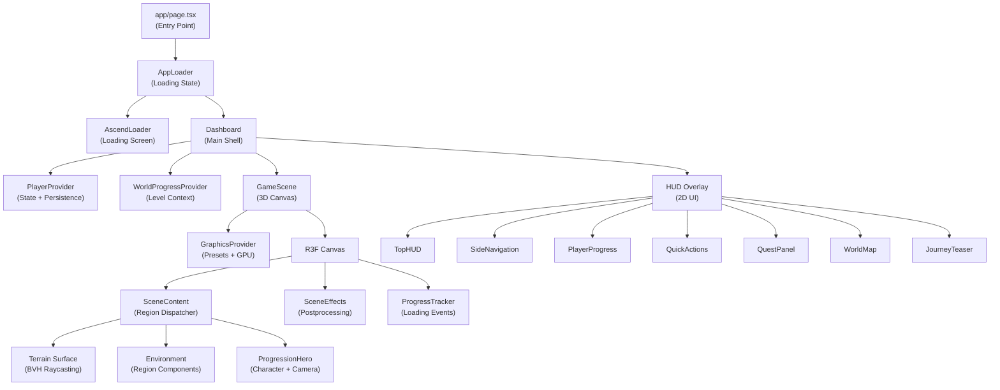

# Architecture

## High-Level Architecture



## Provider Hierarchy

The React provider tree determines data flow:

```
<RootLayout>                           ← Next.js layout
  <PlayerProvider>                     ← Player state + localStorage
    <WorldProgressProvider>            ← Level context + dev preview
      <GraphicsProvider>               ← Graphics presets + GPU detection
        <Canvas>                       ← R3F rendering context
          <SceneContent>               ← Region resolution
            <TerrainSurface>           ← Ground sampler
              <Environment />          ← Region-specific 3D components
              <ProgressionHero />      ← Character + camera
            <ProgressTracker />        ← Loading progress events
        <SceneEffects />              ← Postprocessing (outside Canvas tree)
      </Canvas>
      <HUD />                          ← 2D overlay components
    </WorldProgressProvider>
  </PlayerProvider>
</RootLayout>
```

## Entry Point Flow

```
1. layout.tsx
   - Sets viewport, metadata, theme color
   - Imports globals.css (Tailwind + design tokens)
   - Renders <html> + <body>

2. page.tsx (AppLoader)
   - 800ms delay, then mounts Dashboard
   - AscendLoader overlays during loading
   - Listens for R3F progress events via DOM CustomEvents

3. Dashboard.tsx
   - Wraps in PlayerProvider → WorldProgressGate → WorldProgressProvider
   - Renders GameScene (dynamic import, SSR disabled)
   - Renders HUD overlay (TopHUD, SideNav, PlayerProgress, etc.)
   - Conditionally renders QuestPanel, WorldMap, JourneyTeaser

4. GameScene.tsx
   - Wraps in GraphicsProvider
   - Creates R3F Canvas with region-specific camera/FOV
   - SceneContent resolves region from player level
   - Renders terrain, environment, hero, effects
```

## State Management

### React Context (No External Libraries)

| Context | File | Purpose |
|---------|------|---------|
| `PlayerContext` | `playerStore.tsx` | Player level, XP, gold, streak, quests |
| `WorldContext` | `WorldProgress.tsx` | Effective level, preview override, reload |
| `GraphicsContext` | `GraphicsQuality.tsx` | Preset, config, device profile, auto mode |
| `TerrainSurfaceContext` | `terrainSurface.ts` | Ground sampler function |
| `ForestWindContext` | `ForestWind.tsx` | Wind animation time |

### Data Flow

```
localStorage ←→ PlayerContext → WorldProgressProvider → resolveWorld()
                                                          ↓
                                              GameScene (level → region)
                                                          ↓
                                              Environment (3D components)
```

### Cross-Tree Communication

The R3F Canvas tree and the DOM tree are separate React reconcilers. Communication uses:

1. **DOM CustomEvents** — Loading progress (`ascend-loader-progress`, `ascend-loader-ready`)
2. **DOM CustomEvents** — Graphics preview (`ascend-preview-preset`, `ascend-reset-camera`)
3. **Context** — `useGraphicsQuality()` works in both trees (same provider wraps both)

## 3D Scene Architecture

### Component Hierarchy (inside Canvas)

```
<Canvas>
  <Lighting />                     ← Region-specific lights
  <CameraTuning />                 ← Portrait FOV adjustment
  <Sky />                          ← HDR or procedural sky
  <fogExp2 />                      ← Region atmosphere
  <OrbitControls />                ← Camera interaction
  <SceneContent>
    <ErrorBoundary>
      <Suspense>
        <Surface>                  ← Terrain surface provider
          <Environment />          ← Region 3D components
          <ProgressionHero />      ← Character
          <ProgressTracker />      ← Loading events
          <RegionReady />          ← Ready callback
        </Surface>
      </Suspense>
    </ErrorBoundary>
  </SceneContent>
  <SceneEffects />                 ← Postprocessing
</Canvas>
```

### Region Dispatching

`Environment.tsx` dispatches to region-specific components:

```typescript
if (region === "forest-of-resolve") return <ForestOfResolve />;
if (region === "realm-of-ascension") return <RealmOfAscension />;
// Default: Forgotten Shore
return <group><Terrain /><TidalWater /><DistantMountain />...</group>;
```

### Asset Loading

- Assets load on-demand via `useGLTF()` / `useTexture()` inside Suspense boundaries
- No centralized asset manifest or preloading
- Each region loads its own assets when mounted
- `ProgressTracker` uses drei's `useProgress` to emit loading events

## File Organization

### Naming Conventions

- **Components**: PascalCase (`GameScene.tsx`, `TidalWater.tsx`)
- **Utilities**: camelCase (`grounding.ts`, `skyConfig.ts`)
- **Configs**: camelCase (`forestConfig.ts`, `realmConfig.ts`)
- **Types**: PascalCase (`game.ts` exports `Region`, `Quest`)
- **Region directories**: PascalCase (`ForestOfResolve/`, `RealmOfAscension/`)

### Import Pattern

```typescript
// Relative imports within same domain
import { useGraphicsQuality } from "./GraphicsQuality";

// Path aliases for cross-domain
import { resolveWorld } from "@/lib/world";
import type { RegionSlug } from "@/types/game";
```

## Key Design Decisions

### Why No State Library?

The app uses React Context exclusively. This works because:
- State updates are infrequent (quest completion, level changes)
- No complex state patterns needed
- Reduces bundle size
- Simpler mental model for a single-page app

### Why Dynamic Imports?

`Dashboard` and `GameScene` use `next/dynamic` with `ssr: false` because:
- Three.js cannot render server-side
- The 3D scene requires browser APIs (WebGL, localStorage)
- Reduces initial HTML payload

### Why DOM Events for Loading?

The loading system uses DOM CustomEvents instead of React Context because:
- R3F's Canvas creates a separate React reconciler
- Context from the main tree is NOT available inside Canvas
- DOM events bridge both trees cleanly

### Why Hard Remount for Regions?

Region transitions use `<group key={region.id}>` to force full remount because:
- Each region has completely different geometry, materials, and lighting
- Shared state between regions would cause memory leaks
- Clean disposal via useEffect cleanup is more reliable
- The hero walking animation provides visual continuity

## Performance Architecture

### Rendering Pipeline

```
1. Scene render (R3F)
2. Water reflection pass (Reflector, throttled by cadence)
3. Postprocessing (AO → Bloom → FXAA → ToneMapping)
4. HUD overlay (React DOM)
```

### Optimization Strategies

- **BVH raycasting** for terrain queries (three-mesh-bvh)
- **InstancedMesh** for vegetation (single draw call per mesh type)
- **LOD system** for environment assets (high + low detail variants)
- **Throttled reflections** (configurable cadence per preset)
- **Adaptive DPR** (0.75–2.0 based on preset)
- **Reduced motion** support (disables water/wind/particle animation)
- **Tab visibility** handling (document title changes, render continues)
